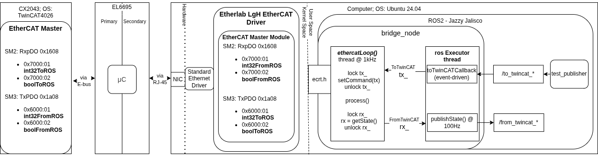
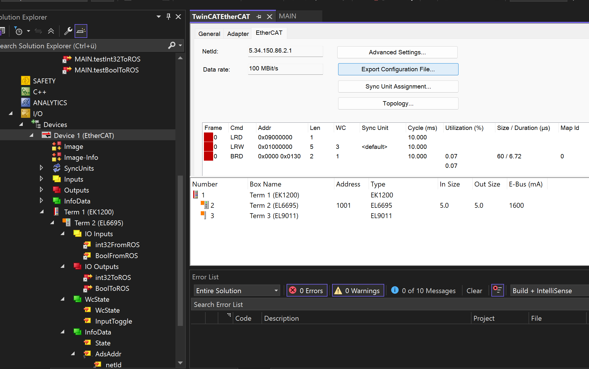

# EtherCAT ROS2 ↔ TwinCAT3 Interface

> A ROS2-TwinCAT3 interface that links non-real time user-space robotics software to a deterministic, realtime environment over EtherCAT through the Beckhoff EL6695 bridge.



---

## Table of Contents

- [About](#about)
- [Why EtherCAT?](#why-ethercat)
- [Hardware & Software Setup](#hardware--software-setup)
- [Architecture](#architecture)
- [Quick Start](#quick-start)
- [How to Add Variables? How modify the I/O?](#how-to-add-variables)
- [Testing](#testing)
- [Performance Test](#performance-test)
- [Further Work](#further-work)

---

## About

This repository implements a **ROS2 ↔ TwinCAT3 communication interface over EtherCAT** using the **Beckhoff EL6695 master-to-master bridge terminal**.
The EL6695 enables symmetric PDO mapping between two independent EtherCAT masters. The primary side is connected to TwinCAT3. The secondary side is connected to ROS2. 

Although ROS2 runs an EtherCAT master (via the IgH EtherCAT driver), it is **conceptually treated as a slave** in the overall system architecture. Control remains within TwinCAT3. ROS suggests actions that are verified in the PLC.

> **Note:** If you want to use ROS2 directly for real-time control (e.g. motion control), do not use this repository. Instead use [ethercat_driver_ros2 by ICube Lab](https://github.com/ICube-Robotics/ethercat_driver_ros2), which integrates EtherLab with `ros2_control`.

---

## Why EtherCAT?

<details>
<summary>Click to expand</summary>

EtherCAT is now the most common fieldbus in industrial robotics and research. Instead of sending individual Ethernet frames to each device (this is wasteful, as the minimum Ethernet frame is 84 bytes), a fieldbus sends a single frame through all devices in a ring. Each subdevice reads and writes to its assigned location in the frame as it goes.

EtherCAT has several built-in reliability mechanisms that can be used for a reliable communication:

| Mechanism | Description |
|-----------|-------------|
| **Frame Integrity / CRC** | Every EtherCAT frame includes a 32-bit CRC checksum |
| **Working Counter (WC)** | Each slave increments a counter when it processes data; any mismatch is detected immediately by the master |
| **Timeout Watchdogs** | Hardware-based watchdogs ensure a safe state if communication is interrupted |
| **Distributed Clocks (DC)** | High-precision synchronisation across the entire network |


</details>

---

## Hardware & Software Setup

<details>
<summary>Hardware</summary>

| Component | Description |
|-----------|-------------|
| **EL6695** (Beckhoff) | EtherCAT bridge clamp — enables real-time data exchange between two buses with different masters |
| **CX2043** (Beckhoff) | Industrial PC running TwinCAT4026 in cyclic deterministic real-time |
| **Precision Tower 5820** | Linux workstation (Intel Xeon W-2135 @ 3.70 GHz, NIC: Intel I219-LM) |

> ⚠️ Make sure your NIC is EtherCAT compatible. Check the [Beckhoff compatibility list](https://infosys.beckhoff.com/english.php?content=../content/1033/tcsystemmanager/9810943371.html&id=8751857768543711394).

</details>

<details>
<summary>Software</summary>

| Component | Version |
|-----------|---------|
| TwinCAT | 4026 |
| ROS2 | Jazzy Jalisco |
| Ubuntu | 24.04 |
| EtherLab IgH EtherCAT Master | 1.6 |

</details>

---

## Architecture

### ROS2 Node Design

The `bridge_node` is implemented using two threads.

A **1 kHz thread (`ethercatLoop()`)** handles the cyclic EtherCAT communication with the EL6695 bridge. In each cycle, the node first calls `ecrt_master_receive()` to pull the latest frame from the network interface hardware buffer. The received data are then processed with `ecrt_domain_process()`, which validates the working counter (WKC) and maps the process data into the application memory. The node reads input data and prepares output data using `std::memcpy`. After updating the process data, `ecrt_domain_queue()` prepares the memory buffer for transmission and `ecrt_master_send()` sends the frame back onto the EtherCAT network.

All ROS2 publishers and subscribers run in a separate **ROS executor thread at 100 Hz**. Communication between the executor and the EtherCAT loop occurs through shared `tx_` and `rx_` data structures. Access to these structures is protected by a `std::mutex` to ensure that the EtherCAT loop and the ROS executor never access the shared memory simultaneously.

### PDO Layout (current)

```
RxPDO (ROS2 → TwinCAT)  SM2: 0x1608
  0x7000:01  int32_t  counter
  0x7000:02  bool     flag

TxPDO (TwinCAT → ROS2)  SM3: 0x1a08
  0x6000:01  int32_t  counter
  0x6000:02  bool     flag
```

### Data Structs (`el6695_slave.h`)

```cpp
#pragma pack(push, 1)
struct ToTwinCAT {
    int32_t counter;
    uint8_t flag;
};
#pragma pack(pop)

#pragma pack(push, 1)
struct FromTwinCAT {
    int32_t counter;
    uint8_t flag;
};
#pragma pack(pop)
```

---

## Quick Start

### 1. Install EtherLab IgH EtherCAT Driver

<details>
<summary>Full installation steps</summary>

**Verify Secure Boot is disabled** (EtherLab is an unsigned kernel module):

```bash
sudo apt-get install mokutil
mokutil --sb-state
# Must print: SecureBoot disabled
# If enabled, disable it in BIOS before continuing.
```

**Install dependencies:**

```bash
sudo apt-get update && sudo apt-get upgrade
sudo apt-get install git autoconf libtool pkg-config make build-essential net-tools
```

**Clone and build:**

```bash
git clone https://gitlab.com/etherlab.org/ethercat.git
cd ethercat
git checkout stable-1.6
sudo rm /usr/bin/ethercat
sudo rm /etc/init.d/ethercat
./bootstrap
./configure --prefix=/usr/local/etherlab --disable-8139too --disable-eoe --enable-generic
make all modules
sudo make modules_install install
sudo depmod
```

**Configure system:**

```bash
sudo ln -s /usr/local/etherlab/bin/ethercat /usr/bin/
sudo ln -s /usr/local/etherlab/etc/init.d/ethercat /etc/init.d/ethercat
sudo mkdir -p /etc/sysconfig
sudo cp /usr/local/etherlab/etc/sysconfig/ethercat /etc/sysconfig/ethercat
```

**Create udev rule:**

```bash
sudo gedit /etc/udev/rules.d/99-EtherCAT.rules
# Add: KERNEL=="EtherCAT[0-9]*", MODE="0666"
```

**Configure your NIC** (find MAC with `ip link`):

```bash
sudo gedit /etc/sysconfig/ethercat
# Set:
# MASTER0_DEVICE="ff:ff:ff:ff:ff:ff"   ← your NIC MAC address
# DEVICE_MODULES="generic"
```

**Start the master:**

```bash
sudo /etc/init.d/ethercat start
# Expected: Starting EtherCAT master 1.6.x  done
```

</details>

### 2. Configure TwinCAT3

Follow section **6.4.2** of the [EL6695 documentation](https://download.beckhoff.com/download/Document/io/ethercat-terminals/el6695_en.pdf) to set up symmetric PDO mapping. Make sure TwinCAT is in **Run Mode** and all I/O are linked to variables before starting the Linux side. 

To verify your PDO mapping, export the ESI configuration file from TwinCAT: go to the device → EtherCAT → *Export Configuration File*. Open it and search for `txpdo` / `rxpdo` — only entries tagged `virtual` are relevant. 


### 3. Build and Run

```bash
# Start EtherLab driver
sudo /etc/init.d/ethercat start

# In your ROS2 workspace
source /opt/ros/jazzy/setup.bash
colcon build
source install/setup.bash

# Run the bridge
ros2 run el6695_ethercat_bridge ethercat_bridge
```

<details>
<summary>Useful EtherLab diagnostic commands</summary>

```bash
# Start / stop / restart the master
sudo /etc/init.d/ethercat start
sudo /etc/init.d/ethercat stop
sudo /etc/init.d/ethercat restart

# Check slave state (OP, PreOP, etc.)
ethercat slaves -v

# Check master state
ethercat master -v

# Show configured PDOs
ethercat pdos

# Show PDO layout as a C struct
ethercat cstruct
```

</details>

---

## Testing

Open separate terminals for each command (source ROS2 and `install/setup.bash` in each):

**Send test data to TwinCAT:**

```bash
ros2 run el6695_ethercat_bridge counter_publisher   # increments int32 counter at 10 Hz
ros2 run el6695_ethercat_bridge bool_toggler        # toggles bool at 1 Hz
```

**Monitor data received from TwinCAT:**

```bash
ros2 topic echo /from_twincat_counter
ros2 topic echo /from_twincat_bool
```

---

## How to Add Variables

Follow these steps whenever you add or modify variables in the PDO mapping.

> Always start from the TwinCAT side and work towards ROS2.

**Step 1 — TwinCAT3:** Add or modify I/O at the EL6695 clamp following section 6.4.2 of the [EL6695 documentation](https://download.beckhoff.com/download/Document/io/ethercat-terminals/el6695_en.pdf). Export the ESI file and check the PDO mapping (only `virtual` entries, not `fixed`).

**Step 2 — `el6695_slave.h`:** Add your variables to the `ToTwinCAT` and `FromTwinCAT` structs:

```cpp
#pragma pack(push, 1)
struct ToTwinCAT {
    int32_t counter;
    uint8_t flag;
    // add new fields here
};
#pragma pack(pop)
```

**Step 3 — `el6695_slave.h`:** Add a private offset member for each new variable:

```cpp
unsigned int offset_tx_counter_;
unsigned int offset_rx_counter_;
unsigned int offset_tx_bool_;
unsigned int offset_rx_bool_;
// unsigned int offset_tx_my_new_var_;
```

**Step 4 — `el6695_slave.cpp` `configure()`:** Add PDO entries. The bit length and subindex come from the exported ESI file. RxPDO (to TwinCAT) goes first:

```cpp
static ec_pdo_entry_info_t pdo_entries[] = {
    {0x7000, 0x01, 32},  // int32_t to TwinCAT
    {0x7000, 0x02,  8},  // bool to TwinCAT
    // {0x7000, 0x03, 16}, // new variable to TwinCAT
    {0x6000, 0x01, 32},  // int32_t from TwinCAT
    {0x6000, 0x02,  8},  // bool from TwinCAT
    // {0x6000, 0x03, 16}, // new variable from TwinCAT
};
```

**Step 5 — `el6695_slave.cpp` `configure()`:** Update `ec_pdo_info_t` entry counts to match:

```cpp
static ec_pdo_info_t pdos[] = {
    {0x1600, 2, &pdo_entries[0]},  // RxPDO — 2 entries
    {0x1A00, 2, &pdo_entries[2]},  // TxPDO — 2 entries
};
```

**Step 6 — `el6695_slave.cpp` `configure()`:** Register the new PDO entry in the domain registration table and link to your offset variable:

```cpp
static ec_pdo_entry_reg_t domain_regs[] = {
    {0, 0, VENDOR_ID, PRODUCT_ID, 0x7000, 0x01, &offset_tx_counter_, 0},
    {0, 0, VENDOR_ID, PRODUCT_ID, 0x7000, 0x02, &offset_tx_bool_,    0},
    // {0, 0, VENDOR_ID, PRODUCT_ID, 0x7000, 0x03, &offset_tx_my_new_var_, 0},
    {0, 0, VENDOR_ID, PRODUCT_ID, 0x6000, 0x01, &offset_rx_counter_, 0},
    {0, 0, VENDOR_ID, PRODUCT_ID, 0x6000, 0x02, &offset_rx_bool_,    0},
    {0, 0, 0, 0, 0, 0, nullptr, 0}
};
```

**Step 7 — `el6695_slave.cpp` `process()`:** Add `memcpy` calls for the new variable using the correct offset:

```cpp
// Write to TwinCAT
std::memcpy(domain_pd_ + offset_tx_counter_, &tx_.counter, sizeof(int32_t));
std::memcpy(domain_pd_ + offset_tx_bool_,    &tx_.flag,    sizeof(uint8_t));

// Read from TwinCAT
std::memcpy(&rx_.counter, domain_pd_ + offset_rx_counter_, sizeof(int32_t));
std::memcpy(&rx_.flag,    domain_pd_ + offset_rx_bool_,    sizeof(uint8_t));
```

**Step 8 — `bridge_node.h` / `bridge_node.cpp`:** Add publisher, subscriber, and callback for the new variable following the existing `counter` / `bool` pattern.

---

## Package Structure

```
el6695_ethercat_bridge/
├── CMakeLists.txt
├── package.xml
├── include/
│   └── el6695_ethercat_bridge/
│       ├── bridge_node.h       # ROS2 node — publishers, subscribers, EtherCAT thread
│       └── el6695_slave.h      # EtherCAT slave abstraction, PDO structs
└── src/
    ├── main.cpp                # Entry point
    ├── bridge_node.cpp         # Node implementation
    ├── el6695_slave.cpp        # EtherCAT PDO config and cyclic process
    ├── counter_publisher.cpp   # Test node: increments int32 counter → /to_twincat_counter
    └── bool_toggler.cpp        # Test node: toggles bool → /to_twincat_bool
```

---

## Performance Test

Roundtrip latency was evaluated in units of the 1 ms PLC cycle. Since the PLC samples incoming data cyclically, latency variations below the cycle time are not observable at the control level and are therefore not safety-relevant.

For the evaluation, a counter value sent from the primary side (TwinCAT PLC) was echoed back by the secondary side. The measured roundtrip time therefore is the time required for a complete request–response cycle.

Three scenarios were evaluated:

1. **Primary:** Beckhoff PLC (TwinCAT 3)  
   **Secondary:** Beckhoff PLC (TwinCAT 3, no DC synchronization)  
   Average roundtrip time: **5 PLC cycles (≈5 ms)**.  
   This matches the EL6695 datasheet, which specifies **4–6 cycles** depending on task jitter and relative task start times.

2. **Primary:** Beckhoff PLC (TwinCAT 3)  
   **Secondary:** Linux workstation running ROS2 (IgH EtherCAT master)  
   The received value was immediately echoed in the fast EtherCAT loop.  
   Average roundtrip time: **≈3 PLC cycles (≈3 ms)** under mild computational load.

3. **Primary:** Beckhoff PLC (TwinCAT 3)  
   **Secondary:** Linux workstation running ROS2  
   The received value was forwarded through the ROS executor (`/to_twinCAT_counter` topic).  
   With publishers and subscribers running at **1 kHz**, the average roundtrip time remained **≈3 ms**.

The experiments show that an event-driven system can sometimes respond faster than a purely cyclic system. However, in safety-critical applications the **deterministic response time** is more important than the fastest possible response.

### CPU Stress Test

To evaluate the effect of system load on the ROS2 workstation, the following stress test was executed:
`stress-ng --cpu 12 --vm 8 --vm-bytes 70% --io 4 --timeout 60s`
This generates heavy CPU, memory, and I/O load simultaneously. Under these conditions, the roundtrip latency increased to approximately **4 ms**, demonstrating that system load on the non-real-time side can influence response time.

## Further Work

- Define proper ROS2 message types (`ToTwinCAT.msg` / `FromTwinCAT.msg`) corresponding to the C structs, enabling typed communication across the ROS2 ecosystem.
- Automate PDO mapping generation from the C struct definitions (or a YAML config), including automatic offset calculation. Maybe: Helper tooling to parse an exported TwinCAT ESI file and generate the `ec_pdo_entry_info_t` / `ec_pdo_entry_reg_t` tables automatically.
