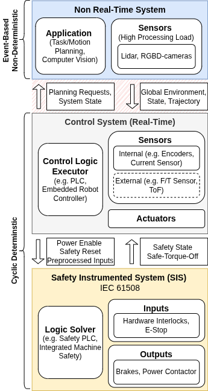

# ROS2 ↔ TwinCAT3 Interfaces

## About
This repository demonstrates **two different bi-directional communication approaches for connecting ROS2 running on Linux with a Beckhoff PLC running TwinCAT3**.
Both presented interfaces enforce a strict separation between deliberative computation and deterministic control. In both architectures, safety authority remains entirely within the real-time domain. The ROS~2 system is treated as a supervised external component whose outputs are conditionally admitted to the real-time layer.

Motivation and System Architecture

Medical robotic systems should rely on deterministic real-time control to ensure predictable and safe interaction with hardware. At the same time, there is a growing interest in incorporating advanced perception, planning, and learning-based capabilities into robotic systems.

Many of the software libraries used for computer vision, motion planning, and machine learning are developed for **general-purpose operating systems**, typically as user-space applications. When developers aim to integrate such capabilities into robotic systems, a flexible software environment becomes advantageous.

To combine deterministic control with a non-real-time system, we propose a **layered system architecture** that separates that separates:
- Safety layer (yellow): safety-instrumented logic (e.g. SIL-rated safety PLC)
- Control layer (grey): deterministic real-time control (PLC / RTOS)
- Deliberative layer (blue): high-level computation (ROS2 on Linux)

The challenge lies in designing the interface between the non-real-time and real-time systems (shaded red in the figure). Why? Because failures in the non-real-time system could affect the hardware. 

## Implemented Interfaces

### EtherCAT Interface
[See the full documentation for details on code structure, installation, and usage.](EtherCAT/README.md)

- Industrial fieldbus-based communication
- Supervision handled at protocol level (working counter, watchdogs, CRC, DC sync)
- Requires dedicated EtherCAT hardware (Master-Master bridge, EtherCAT compatible NIC)

### UDP/IP Interface 
[See the full documentation for details on code structure, installation, and usage.](UDP/README.md)

- Vendor-independent communication over standard Ethernet 
- Supervision implemented at application layer in each UDP datagram: 
    - checksum for message integrity
    - timestamps for communication timeout and packet order
- No specialized hardware required

## Design Guidelines and Recommendations
###
Independent of the chosen communication protocol, we highly recommend to **maintain a single determinism boundary/interface** between the ROS ecosystem and the real-time controller.

Within the ROS environment, multiple perception nodes, workstations, or planning modules can communicate freely using DDS without real-time guarantees. 

### Which interface to choose?

Both interfaces implement the same architectural concept but represent different engineering trade-offs. The EtherCAT-based approach is particularly suitable when industrial EtherCAT infrastructure is already available. The clamp provides in addition a galvanic isolation.

The UDP-based interface, in contrast, is advantageous when the interface should run on any real-time capable platform using standard Ethernet (completely vendor-independent). 

During early system development, the **UDP interface** was in our project more convenient because modifying the communication interface typically only requires adjusting the shared C-style data structures on both sides. EtherCAT, on the other hand, requires explicit configuration of Process Data Objects (PDOs), which makes the initial setup slightly more involved but results in a more tightly integrated industrial solution.

## License
This project is licensed under the Apache License 2.0. See the `LICENSE` file for details.

