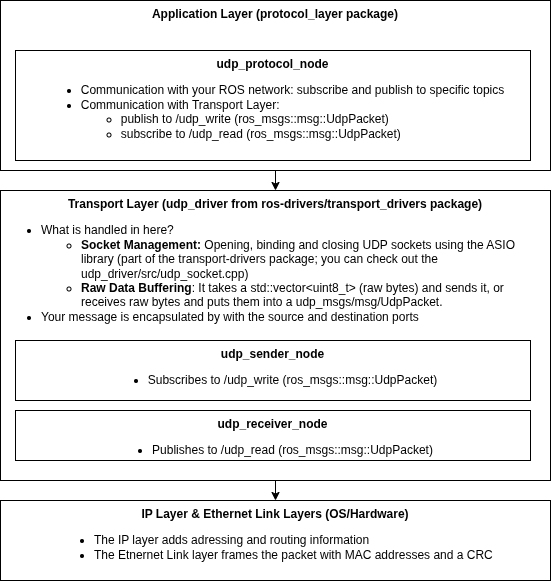

# TC3ROS2 interface

This project showcases a very simple bidirectional real-time UDP/IP interface between an application running in ROS2 (on a Linux based system) and an application running in hard-realtime on a Beckhoff PLC - CX. This project was tested on a yoga pro 9 16IMH laptop running ROS2 -jazzy jalisco and a CX2020 running TwinCAT 4026.12..

<details>
  <summary>Why and How UDP/IP communication?</summary>
  It is faster than TCP/IP (is ideal for applications that require low latency, high throughput). The shortcoming of UDP/IP is that packages might get lost. For safety-critical applications in medical robotics this might be a bit of a problem. This is why it is good practice to implement your own application level logic. What does that mean? UDP/IP uses by default checksums, but these are just for general network integrity. A bit in your payload might still have flipped and so your data is corrupted. Another problem is that UDP messages don't arrive in order. So how do you know whether the package is from a second ago? In industry one refers to the “black channel” which is defined in the IEC61508 - you cant trust the network and should implement your own safety such as profinet for instance (https://www.phoenixcontact.com/en-pc/industries/functional-safety/black-channel-principle).
To deal with these problems this sample project implements on the application level (before the message is serialized and packed as a UDP message):
- Timestamp: The CX system sends its timestamp with every message. Each other system in the network echoes the last received timestamp. This is how you get the latency.
- Checksum: To ensure that no bit has flipped in your message, we calculate a checksum on the payload. The checksum is calculated by adding up the bits using a generator polynomial (in this project 0x07).    
- Keyword: The keyword helps to distinguish between messages containing different data. (If you set it consistently when making changes to your code, you can avoid using different versions on both ends.) 
</details>

## Sample Project

In this project the following datastructures are sent/received:

__toTwinCAT__/__fromROS__
| Member Name | Data Type | Size (Bytes) |
| :--- | :--- | :--- |
| `keyword` | `uint8_t` | 1 |
| `crc8` | `uint8_t` | 1 |
| `timestamp` | `uint64_t` | 8 |
| `a_byte` | `uint8_t` | 1 |
| `an_integer` | `uint16_t` | 2 |
| **Total** | | **13** |

__fromTwinCAT__/__toROS__
| Member Name | Data Type | Size (Bytes) |
| :--- | :--- | :--- |
| `keyword` | `uint8_t` | 1 |
| `crc8` | `uint8_t` | 1 |
| `timestamp` | `uint64_t` | 8 |
| `an_integer` | `uint16_t` | 2 |
| **Total** | | **12** |

The padding is disabled (in C++: #pragma pack(push,1), in TwinCAT3: {attribute 'pack_mode' :='1'}). The struct is copied into a buffer of bytes using memcpy to ensure one-to-one transmission. If you track the sent/received packages in Wireshark you will be able to confirm that the size of the UDP payload (Data) is exactly equal to your struct.

### ROS side architecture 
As you can see from the schematic, two ROS packages (protocol_layer and transport_drivers) are used to establish UDP/IP communication. (Note: you could use a single file or package for the same purpose.) However, the idea was to create an abstraction according to the network protocol stack for UDP/IP communication, separating this into an application layer that your user application interacts with - the __protocol_layer__, and a transport layer package that packs the UDP message (with UDP header, length and checksum) and handles the socket - __transport_drivers__. This makes the software easily adaptable and extendable. 



### TwinCAT3 side
In the PLC project the MAIN program calls a the function block __FB_UdpSenderReceiver__ that implements the interface ITcIoUdpProtocolRecv  as explained in [TF6311 | TwinCAT 3 TCP/UDP Realtime](https://infosys.beckhoff.com/english.php?content=../content/1033/tf6311_tc3_tcpudp/1412819083.html&id=). This Function block has the methods:
- FB_init: store the configuration (destiantion ip and port etc.) that you gave in main into variables; gets udp protocol interface; opens the udp port.
- FB_reinit: if you apply online changes
- FB_exit: close udp port
- TcAddRef, TcQueryInterface, TcRelease: lets us treat the function block as a COM object. 
- ComputeCrc8IgnoringFirstTwoElements: calculates the checksum using polynomial 0x07. It skips the first two bytes because it assumes that they are keyword and checksum. 

## How to use it?


<details>
  <summary>Setup UDP ports</summary>

### 1. ROS (Physical Device) Configuration
Set the port to static and into the same subnet. 
* **Suggested IPv4:** `50.50.50.1`
* **Netmask:** `255.255.255.0`

### 2. CX (Windows 10) Settings
Set the IPv4 address of the ethernet adapter intended for UDP communication to static (e.g., `50.50.50.50`).

### PowerShell Configuration
Find the correct network adapter by opening a terminal with elevated rights:

```powershell
# List all adapters
Get-NetAdapter

# Replace "X000" with your specific adapter alias
Remove-NetIPAddress -InterfaceAlias "X000" -AddressFamily IPv4 -Confirm:$false

New-NetIPAddress -InterfaceAlias "X000" `
    -IPAddress "50.50.50.50" `
    -PrefixLength 24

#if NetIPAddress is not supported use netsh
netsh interface ipv4 set address name="X000" static 50.50.50.50 255.255.255.0
```
Note: Always check with ipconfig /all to ensure changes have been applied.

### 3. TwinCAT settings
1. Scan for devices and add the physical adapter (e.g., X000).
2. Configure the TCP/UDP RT module.
3. Follow the official Beckhoff TF6311 Instructions to set up the real-time UDP port and link it to your PLC project.
</details>

### ROS 2 Workspace Setup

#### Installation
```bash
# Clone the repository and submodules
git clone --recurse-submodules git@dbe-gitlab.dbe.unibas.ch:BIROMED-Lab/tc3ros2-interface.git
```
#### Building
```bash
# Navigate to your workspace
cd ~/ROS2

# Source ROS 2 Jazzy environment
source /opt/ros/jazzy/setup.bash

# Build the workspace
colcon build

# Source the newly built setup file
source install/setup.bash
```

### Running
```bash
ros2 launch protocol_layer udp_transport.launch.py
```

### Getting started and implementing your code
In TwinCAT3:
1. change the structs PLC/DUTs/ST_UdpFromROS and  PLC/DUTs/ST_UdptoROS
2. configure the network settings in Main (Ip and Port, Keyword)

In ROS2:
1. Change the structs to your needs: protocol_layer/include/protocol_layer/message_definitions.h
2. subscribe to your data topics in protocol_layer/src/udp_protocol_node.cpp
3. convert the data in the way you need it. 


## Troubleshooting
### Connection Test
If the launch fails or data isn't flowing, verify the physical connection between your ROS device (50.50.50.1) and the CX (50.50.50.50): 
- from the ROS terminal: ping 50.50.50.50
- from the CX: ping 50.50.50.1. 

### Wireshark
Wireshark is extremly useful to understand what is actually sent. Launch it with elevated permissions (sudo) and track the network traffic on the ethernet adpater that you have configured at Ipv4: 50.50.50.1. 

## Roadmap
A next step would be to test how fast the ROS side can run. It runs at the moment at 10Hz.

## Contributing
Contact jan.schimmelpfennig@unibas.ch if you have questions.

## Authors and acknowledgment
Credits to Lorin Fasel. The PLC project was started of from Lorins PLC project for the UDP communication with the Falcon: https://dbe-gitlab.dbe.unibas.ch/BIROMED-Lab/forcedimension-throttle-for-udp 


